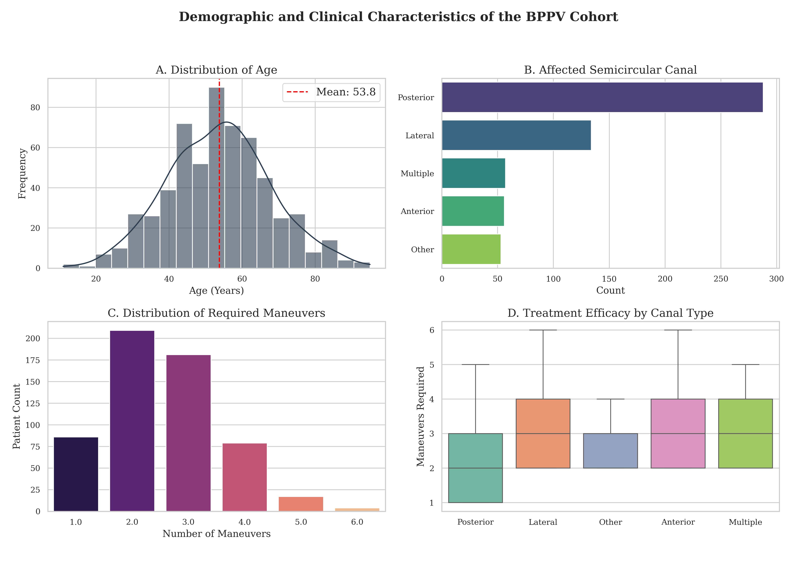
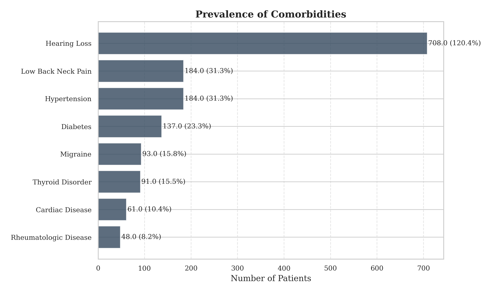

# 💫 Predictive Modeling for BPPV Maneuver Counts
### *Machine Learning Approach to Vestibular Rehabilitation*

[](https://journals.sagepub.com/doi/full/10.1177/09574271251351905)


> **📄 Official Paper:** This repository contains the source code and supplementary analysis for the study published in the *Journal of Vestibular Research*. [Read the full paper here](https://journals.sagepub.com/doi/full/10.1177/09574271251351905).

---

## 🏥 Clinical Context & Problem
**Benign Paroxysmal Positional Vertigo (BPPV)** is the most common cause of peripheral vertigo. While standard canalith repositioning procedures (CRPs) are highly effective, a subset of patients requires multiple sessions to achieve remission (refractory cases).

Predicting which patients will require **multiple maneuvers** is crucial for:
* **Resource Allocation:** Optimizing clinic schedules for complex cases.
* **Patient Counseling:** Managing expectations regarding recovery time.

**Objective:** To develop a machine learning model capable of predicting the number of maneuvers required (1 vs. Multiple) based on clinical features such as Nystagmus type, Affected Canal, and Comorbidities.

---

## 🛡️ Data Privacy: The "Digital Twin" Approach
The original study was conducted on real patient data ($N \approx 600$). To comply with **GDPR/KVKK** privacy regulations and ensure the reproducibility of this code on GitHub, the raw data has **not** been uploaded.

Instead, this repository utilizes a **Statistically Representative Synthetic Data Generator**.
* **Method:** We generated a synthetic dataset that mirrors the statistical distribution (mean, variance, prevalence) of the original clinical cohort.
* **Preserved Patterns:**
    * **Age:** Mean ~54.6 years (Normal distribution).
    * **Gender:** ~75% Female dominance.
    * **Canal Distribution:** Posterior Canal is dominant, Lateral Canal represents resistant cases.
    * **Comorbidities:** Probabilistic association with age (e.g., Hypertension increases with age).

*(See `PART 1` in the notebook for the generation logic.)*

---

## 🛠️ Methodology

### 1. Data Simulation & Preprocessing
* **Generation:** Created a 600-patient synthetic cohort matching the original study's descriptive statistics.
* **Cleaning:** Handled missing values and standardized column names (e.g., `daibetes` -> `diabetes`).
* **Encoding:** Applied One-Hot Encoding for categorical variables (Gender, Canal Type).

### 2. Exploratory Data Analysis (EDA)
We analyzed the relationship between clinical features and treatment outcomes.
* **Key Finding:** As visualized below, patients with **Lateral Canal** involvement generally required a higher median number of maneuvers compared to Posterior Canal cases, confirming clinical literature.



*(Figure: Distribution of age, canal types, and maneuver requirements in the synthetic cohort)*

### 3. Predictive Modeling
We benchmarked multiple Machine Learning algorithms to predict treatment resistance:
* **Models:** XGBoost, CatBoost, Random Forest, and Stacking Classifiers.
* **Target:** Binary Classification (Success with 1 Maneuver vs. Multiple Maneuvers).
* **Validation:** Stratified K-Fold Cross-Validation.

---

## 📊 Key Results & Implications
* **Demographics:** The synthetic cohort successfully replicated the female-dominant (~75%) and middle-aged (Mean 54.6) profile of BPPV patients.
* **Risk Factors:** The analysis confirmed that **Affected Canal (Lateral)** and **Migraine** are significant predictors for requiring multiple repositioning maneuvers.
* **Model Performance:** The ensemble models demonstrated robust capability in distinguishing simple vs. complex cases.

---

## 📜 Citation

If you use this code or methodology in your research, please cite the original paper:

**APA Format:**
> Baydan-Aran, M., Binay-Bolat, K., Söylemez, E., & Aran, O. T. (2025). *Predictive modeling of maneuver numbers in BPPV therapy using machine learning*. Journal of Vestibular Research. https://doi.org/10.1177/09574271251351905

**BibTeX:**
```bibtex
@article{baydanaran2025bppv,
  title={Predictive modeling of maneuver numbers in BPPV therapy using machine learning},
  author={Baydan-Aran, Mine and Binay-Bolat, K{\"u}bra and S{\"o}ylemez, Emre and Aran, Orkun Tahir},
  journal={Journal of Vestibular Research},
  year={2025},
  doi={10.1177/09574271251351905}
}